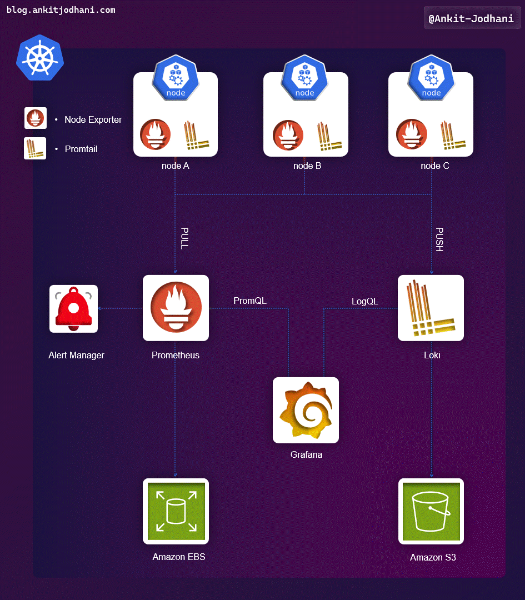

# ⏰ Ultimate Guide to Monitoring & Logging on AWS EKS: Prometheus, Grafana, Loki, and Promtail
✨ This repository provides a comprehensive guide to setting up monitoring and logging on AWS EKS using open-source tools like Prometheus, Grafana, Loki, and Promtail. It includes detailed instructions on installation, configuration, and deployment to ensure seamless application performance and effective log management.

## 💡 Objective of the Project
The objective is to implement a robust monitoring and logging solution for applications running on AWS EKS clusters. This guide covers the following:
- Creating custom metrics and setting up alerting mechanisms
- Storing prometheus time-series data into AWS EBS
- Visualizing data using Grafana dashboards
- Collecting and aggregating logs with Loki and Promtail
- Storing logs in AWS S3 for persistence

## 🎯 Architecture
The architecture involves Prometheus for scraping metrics, storing them in AWS EBS volumes, and alerting through Alertmanager. Promtail collects logs, sending them to Loki, which aggregates and stores logs in AWS S3. Grafana visualizes both metrics and logs.

## 🚀 Setup Instructions
Please go through my blog to get more detailed setup by step by instuction

- **Blog:** [🔗 Links](https://blog.ankitjodhani.com/ultimate-guide-monitoring-logging-aws-eks-prometheus-grafana-loki-promtail/)

## 🙌 Conclusion

This guide provides a detailed approach to setting up a complete monitoring and logging solution on AWS EKS. By following the steps, you can ensure robust monitoring and logging for your applications, facilitating better performance management and troubleshooting.

## 🤙 Contact

If you have any questions or feedback, feel free to reach out:

- **LinkedIn:** [Ankit Jodhani](https://www.linkedin.com/in/ankit-jodhani/)
- **GitHub:** [AnkitJodhani](https://github.com/AnkitJodhani)

---

*If you found this guide helpful, please star the repository and share it with others!*

🙏 Thank you so much for reading..

## 🎒 Resources
- [Prometheus Operator](https://github.com/prometheus-community/helm-charts/tree/main/charts/kube-prometheus-stack)
- [Grafana/loki](https://github.com/grafana/helm-charts/tree/main/charts/loki-distributed)
- [Grafana/promtail](https://github.com/grafana/helm-charts/tree/main/charts/promtail)
- [Blog](https://dev.to/aws-builders/monitoring-eks-cluster-with-prometheus-and-grafana-1kpb)
- [Github issues](https://github.com/grafana/loki/issues/7335)
- [Stack Overflow](https://stackoverflow.com/questions/76873980/loki-s3-configuration-for-chunks-and-indexes)
- [Loki to S3](https://blog.srev.in/posts/grafana-loki-with-amazon-s3/)
- [Blog](https://akyriako.medium.com/kubernetes-logging-with-grafana-loki-promtail-in-under-10-minutes-d2847d526f9e)

